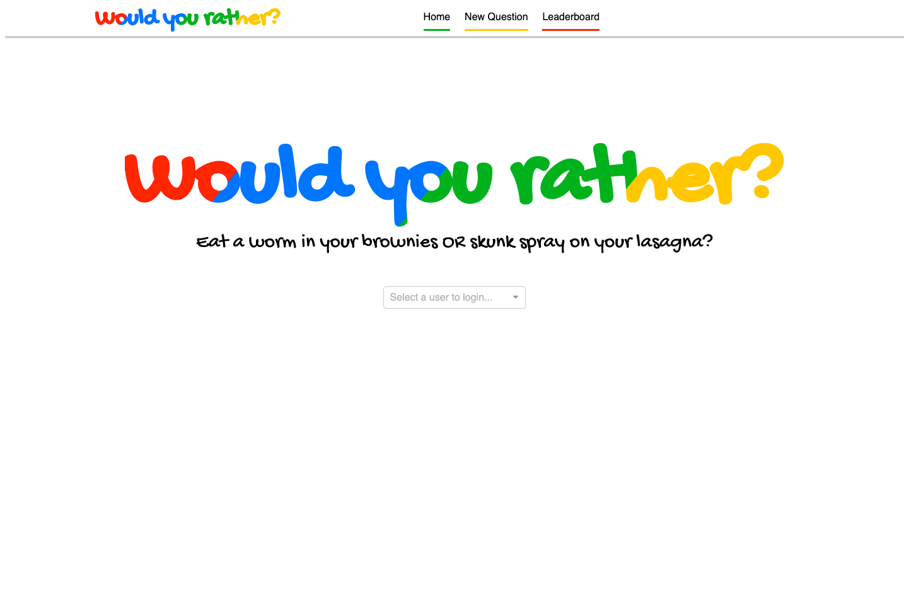
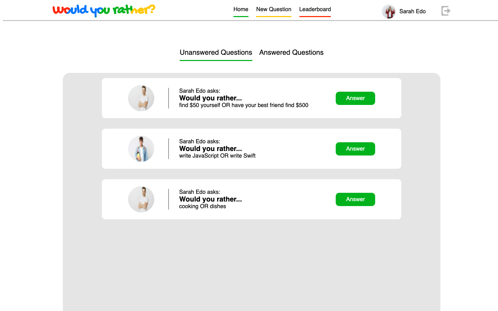
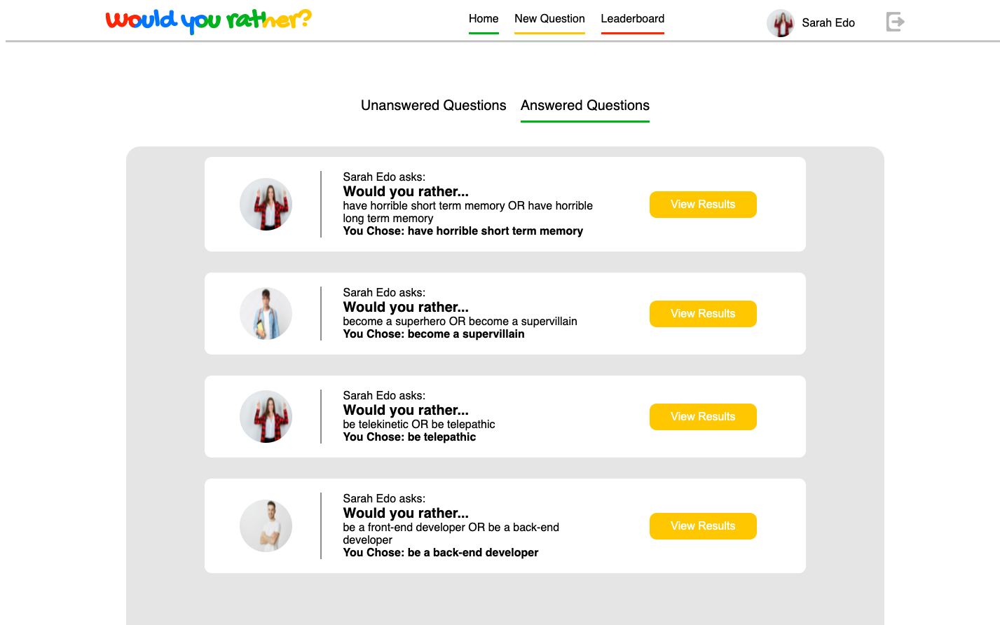
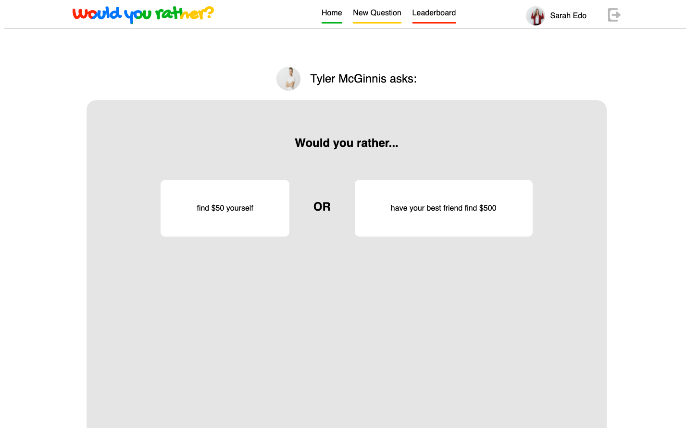
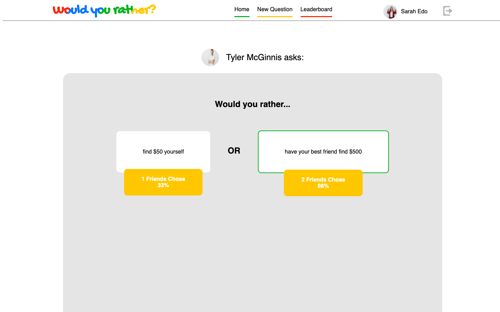
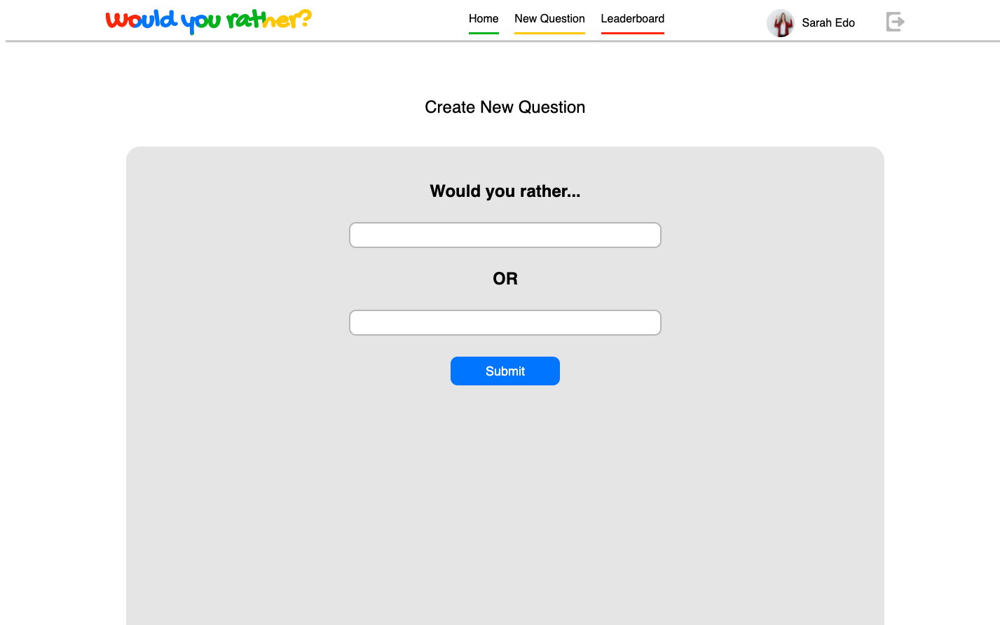
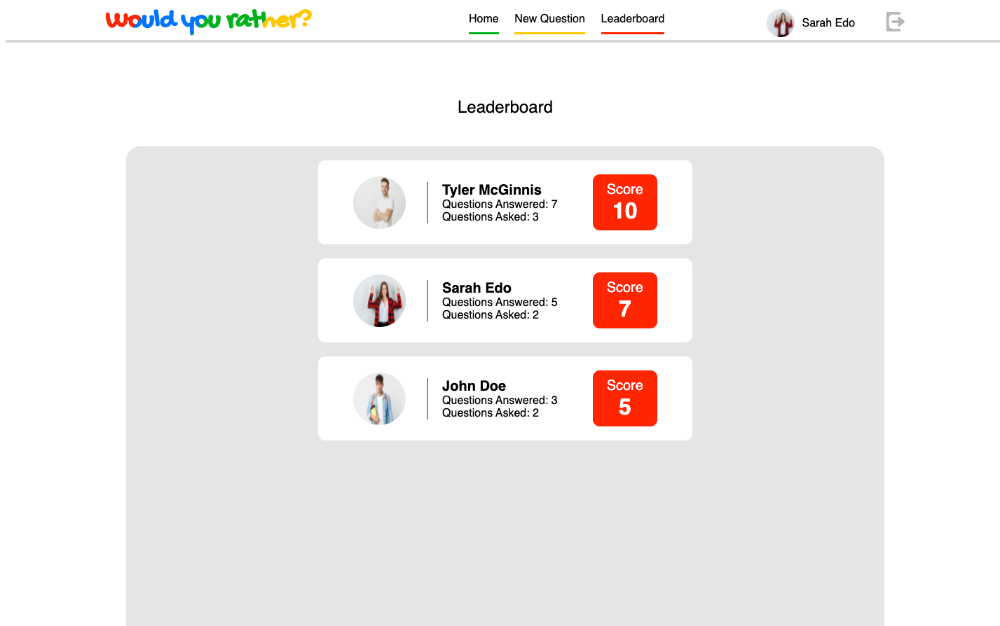

# Would You Rather?
This would you rather game closely follows the traditional Would You Rather card game with some twists. With your scores saved and the ability to add your own questions this Would You Rather spin-off will keep you and your family laughing for hours as you compete for the high score. The more questions you ask, the more questions you answer, the more likely you are to stand out above the rest.

## Prerequisites
#### MacOS
1. Install [Homebrew](https://brew.sh/) by running `/usr/bin/ruby -e "$(curl -fsSL https://raw.githubusercontent.com/Homebrew/install/master/install)"` in the terminal.
1. Check that it was installed by running `brew --version`. You should see the version number that was installed.
1. Run `brew install node`.
1. Run `node --version`.
1. Check that `npm` was installed as well by running `npm --version`.
1. Run `brew install yarn`.
1. Run `npm --version`.
1. Run `yarn install && yarn --version`

#### Windows
1. Please download the [Node.js Installer](https://nodejs.org/en/download/), go through the installation process, and restart your computer once you're done.
1. Please follow the `yarn` [installation instructions](https://classic.yarnpkg.com/en/docs/install#debian-stable).
1. Run `yarn --version` to make sure `yarn` has been successfully installed.

#### Linux
1. Please follow [these instructions](https://ostechnix.com/install-node-js-linux/) to install Node.js.
1. Run `sudo apt-get install -y build-essential`.
1. Please follow the `yarn` [installation instructions](https://classic.yarnpkg.com/en/docs/install#debian-stable).
1. Run `yarn --version` to make sure `yarn` has been successfully installed.

## How to Install
1. Clone this repo.
1. Run `npm install` in the main folder of the repo.

## How to Use
1. Run `npm start` in the main folder of the repo.
1. Select an existing user to login as.

    

1. Answer and view the stats for questions you and others have created from the home page

    
    

1. Answer a question by clicking on the Answer button for a question on the unanswered questions tab of the home page.

    

1. See the stats for questions you have answered by clicking on the View Results button for a question on the answered questions tab of the home page.

    

1. Create new questions by clicking on the New Question navigation link in the header.

    

1. Keep an eye on the competition from the leaderboard by click on the navigation link in the header.

    

1. Logout using the logout icon in the top right corner of the header

    

## Things to Consider
Only a subset of data is stored, so you're new questions and answered won't survive a page refresh. That feature will be available in a future release.

## Contributions
Thanks to our friends at freepik.com for the user avatars.